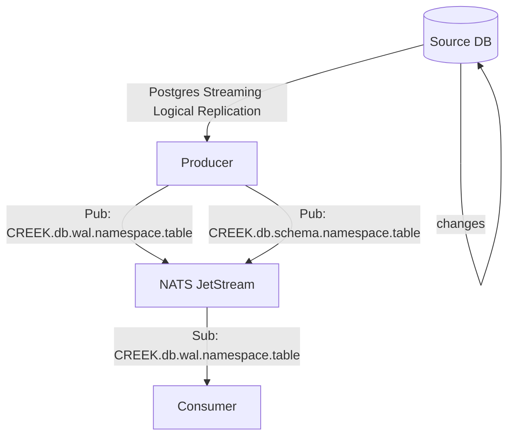

# Creek <!-- omit from toc -->

> A PostgreSQL Change-Data-Capture (CDC) based system for event sourcing.

## Motivation

Many services inside Modular Finance depend on the same core data. This data is
useful for many services, but keeping it  in sync can be cumbersome. Some
projects have tried to break away from the core database while still needing
some of its data. Currently, no standardized way of synchronizing data is used.
A CDC system allows capturing changes from a database in real-time and
propagating those changes to downstream consumers. This can have many uses
beyond keeping two SQL databases in sync, such as streaming changes to a
specialized search database.

## Architecture

Creek consists of two major parts: producers and consumers. A producer is
responsible for listening for change events on a PostgreSQL database and
publishing events on a Message Queue (MQ). The MQ used is [NATS
JetStream](https://docs.nats.io/nats-concepts/jetstream). Events are published
to topics corresponding to the table name. Generally, a practical system will
only consist of one producer database that acts as a single source of truth, but
creek is flexible and allows using multiple producers, as long as they have
different table names.

A system may consist of multiple consumers, and even different types of
consumers. A [PostgreSQL consumer](https://github.com/modfin/creek-pg-client)
has been implemented. This consumer applies changes on from a source table on a
topic to a specified table in a consumer PostgreSQL database.



### Producer architecture

The producer works by leveraging [Postgres Logical
Replication](https://www.postgresql.org/docs/12/logical-replication.html). It
directly hooks into the Postgres Logical Replication Protocol emitted from
`pgoutput` via the [pglogrepl](https://github.com/jackc/pglogrepl) Go library.
It can then listen to events from the PostgreSQL Write-Ahead Log (WAL) on
specific tables, and emit messages to a NATS JetStream MQ.

Postgres logical replication can be started for a _Replication Slot_, which
corresponds to one consumer of a Postgres _Publication_. A publication can be
defined for specific tables. The replication slot contains information about the
current position in the WAL. As such, when restarting the producer, it will
continue from the last processed WAL location, and include events that may have
happened while the producer was offline.

The messages produced are encoded using the binary
[Avro](https://avro.apache.org/) data serialization format. This means that
messages are encoded in efficient format that allows simple serialization and
deserialization. Avro relies on using a _schema_ when both decoding and encoding
messages, and the same schema that was used to encode a message must be used
when decoding it. Schemas can be uniquely identified by a 64-byte _fingerprint_.

The creek producer automatically generates _Avro schemas_ based on the columns
of the producer PostgreSQL database, and uses them to encode its messages. The
producer is responsible for publishing schemas used to encode its messages, and
persisting the schemas in order to be able to provide it to clients that request
the schema.

### WAL

The creek producer publishes WAL events for each table on the topic
`[creek-ns].[db].wal.[ns].[table]`, where `creek-ns` is a global namespace for
creek (by default `CREEK`), `db` is the database name, `ns` is the Postgres
namespace (aka. schema) for the table, and `table` is the name of the table.
Messages are encoded using Avro, and the messages will have differing schemas.
For example, a message for a table with the following Postgres schema:

```SQL
CREATE TABLE test (
    id int PRIMARY KEY,
    name text,
    at timestamptz
);
```

Will have the following corresponding Avro schema:

<details>
    <summary>View schema</summary>

```json
{
    "name": "publish_message",
    "type": "record",
    "fields": [
        {
            "name": "fingerprint",
            "type": "string"
        },
        {
            "name": "source",
            "type": {
                "name": "source",
                "type": "record",
                "fields": [
                    {
                        "name": "name",
                        "type": "string"
                    },
                    {
                        "name": "tx_at",
                        "type": {
                            "type": "long",
                            "logicalType": "timestamp-micros"
                        }
                    },
                    {
                        "name": "db",
                        "type": "string"
                    },
                    {
                        "name": "schema",
                        "type": "string"
                    },
                    {
                        "name": "table",
                        "type": "string"
                    },
                    {
                        "name": "tx_id",
                        "type": "long"
                    },
                    {
                        "name": "last_lsn",
                        "type": "string"
                    },
                    {
                        "name": "lsn",
                        "type": "string"
                    }
                ]
            }
        },
        {
            "name": "op",
            "type": {
                "name": "op",
                "type": "enum",
                "symbols": [
                    "c",
                    "u",
                    "u_pk",
                    "d",
                    "t",
                    "r"
                ]
            }
        },
        {
            "name": "sent_at",
            "type": {
                "type": "long",
                "logicalType": "timestamp-micros"
            }
        },
        {
            "name": "before",
            "type": [
                "null",
                {
                    "name": "integration_tests",
                    "type": "record",
                    "fields": [
                        {
                            "name": "id",
                            "type": {
                                "type": "string",
                                "logicalType": "uuid"
                            },
                            "pgKey": true,
                            "pgType": "uuid"
                        }
                    ]
                }
            ]
        },
        {
            "name": "after",
            "type": [
                "null",
                {
                    "name": "integration_tests",
                    "type": "record",
                    "fields": [
                        {
                            "name": "id",
                            "type": {
                                "type": "string",
                                "logicalType": "uuid"
                            },
                            "pgKey": true,
                            "pgType": "uuid"
                        },
                        {
                            "name": "data",
                            "type": [
                                "null",
                                "string"
                            ],
                            "pgKey": false,
                            "pgType": "text"
                        }
                    ]
                }
            ]
        }
    ]
}
```
</details>


### Schemas

The creek producer publishes the Avro schemas for each table on the topic
`[creek-ns].[db].schema.[ns].[table]`, where `creek-ns` is a global namespace
for creek (by default `CREEK`), `db` is the database name, `ns` is the Postgres
namespace for the table, and `table` is the name of the table. These messages
are sent as plain JSON with the following structure:

```json
{
    "fingerprint": "Sykce18MgAQ=", // Base64 url-encoded fingerprint
    "schema": "...",
    "source": "namespace.table",
    "created_at": "YYYY..."
}
```

In addition, the producer persists schemas in the database that it is connected
to. Clients can request this schema using NATS Request-Reply. A client issues
a message to `[creek-ns]._schemas` with the fingerprint of the schemas, and 
will (if available) receive the schema from a producer that has the schema.

### Snapshots

The WAL does not contain all data in the database, so in order to be able to get
a consistent view of the database, we need to be able to take snapshots of the
data. A snapshot is taken by the producer. Each snapshot taken will be written
to a separate topic, with the name
`[creek-ns].[db].snap.[ns].[table].[ts]_[id]`. Here, `creek-ns` refers to the
global namespace for creek (by default `CREEK`), `db` is the database name, `ns`
is the Postgres namespace for the table, `table` is the name of the table, `ts`
is a timestamp of when the snapshot was taken in the form `YYYYMMDDHHMMSS_MS`,
and `id` is a 4 character id of the snapshot. 

On each snapshot topic, the first message will be a snapshot header containing
a JSON record in the following form:

```json
{
    "fingerprint": "Sykce18MgAQ=", // Base64 url-encoded fingerprint
    "schema": "...",
    "tx_id": 6550070, // Postgres transaction id
    "lsn": "54/D8213EB8", // Postgres WAL log sequence number (lsn)
    "at": "YYYY...", // Timestamp
    "approx_rows": 2312
}
```

Following will be $n$ number of messages containing the data for each row in the
database. This is follow by an end message containing the bytes `0x45 0x4f 0x46`
(EOF).

Clients can request a snapshot using NATS Request-Reply. Clients send a JSON
message on the channel `[creek-ns]._snapshot` in the following form:

```json
{
    "database": "db",
    "namespace": "namespace",
    "table": "table"
}
```

If the database, namespace, and table exists, a producer will respond with a
topic on which the snapshot will written to. The client can now begin reading
from this channel.

## Postgres setup

The producer database requires a user with replication permission, access
allowed in `pg_hba.conf`, and logical replication enabled in `postgresql.conf`.

Add a replication line to your pg_hba.conf:

```
host replication [database] [ip address]/32 md5
```

Make sure that the following is set in your postgresql.conf:

```
wal_level=logical
max_wal_senders=5
max_replication_slots=5
```

Also, it is a (very) good idea to set a max size of the WAL size, otherwise it will grow to infinity 
when the producer is offline. This option only exists since Postgres 13.

```
max_slot_wal_keep_size=16GB
```


## Configuring

The producer is configured using the following environment variables:

```
PG_URI
PG_PUBLICATION_NAME
PG_PUBLICATION_SLOT
PG_MESSAGE_TIMEOUT
PG_TABLES

NATS_NAMESPACE
NATS_URI
NATS_TIMEOUT
NATS_MAX_PENDING


LOG_LEVEL
PROMETHEUS_PORT
```

It is also possible to add tables to listen to while the producer is running
using a PostgreSQL API. On the same database as the producer is connected to:

```SQL
-- Add table to listen to
SELECT _creek.add_table('publication_name', 'namespace.table');

-- Remove a table to listen to
SELECT _creek.remove_table('publication_name', 'namespace.table');
```

## Usage

This project includes a client library for consumers written in Go.
Refer to the documentation for more information.
Example usage of the client:

```golang
package main

import (
  "context"
  "encoding/json"
  "fmt"
  "github.com/modfin/creek"
  "github.com/nats-io/nats.go"
)

func main() {
  conn, err := creek.NewClient(nats.DefaultURL, "CREEK").Connect()
  if err != nil {
    panic("failed to connect to creek")
  }

  stream, err := conn.SteamWAL(context.Background(), "db", "namespace.table")
  if err != nil {
    panic("failed to to stream WAL")
  }

  for {
    msg, err := stream.Next(context.Background())
    if err != nil {
      panic(fmt.Errorf("failed to get next wal message: %w", err))
    }

    b, _ := json.Marshal(msg)
    fmt.Println(string(b))
  }
}
```

## Security considerations

There is currently no authentication built into Creek. You will probably want to
enable authentication to your NATS cluster. Also, be careful with what tables
you export from the producer, since all clients connected to nats will be able
to stream WAL events and request full snapshots of this table which will be
visible to all clients, even if it might contain sensitive data.

## Metrics

The producer produces Prometheus metrics that are available on
`ip:PROMETHEUS_PORT/metrics`.

## Limitations

Due to the scope of the project, not all Postgres types are supported. Refer to
the pgtype-avro [README](./pgtype-avro/README.md) for a full list of supported
types.